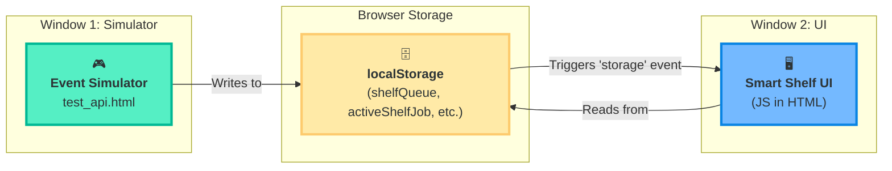

# RFID Smart Shelf - Frontend Simulation (v1.0)

เอกสารนี้สรุปภาพรวม สถาปัตยกรรม และรายละเอียดทางเทคนิคของโปรเจกต์ RFID Smart Shelf เวอร์ชัน Frontend-Only เพื่อให้ง่ายต่อการทำความเข้าใจและนำไปทดสอบ

---

## 🚀 1. ภาพรวมโปรเจกต์ (Project Overview)

โปรเจกต์นี้คือระบบจำลองชั้นวางของอัจฉริยะ (Smart Shelf) ที่ทำงานบนเบราว์เซอร์ทั้งหมด (Frontend-Only) โดยไม่จำเป็นต้องใช้ Backend Server ระบบประกอบด้วยสองส่วนหลัก:

1.  **Smart Shelf UI (`shelf_ui.html`):** หน้าจอสำหรับแสดงผลสถานะของชั้นวางและคิวงานแบบ Real-time
2.  **Event Simulator (`test_api.html`):** เครื่องมือสำหรับสร้างงานและจำลองเหตุการณ์ต่างๆ เช่น วางของสำเร็จ หรือวางของผิดที่

**เทคโนโลยีหลัก:**
- **Frontend:** HTML5, CSS3, JavaScript (ES6+)
- **Data Storage:** Browser `localStorage`
- **Real-time Communication:** `StorageEvent` API (สำหรับการสื่อสารระหว่างแท็บ)
- **Architecture:** Client-side only (No Backend Required)

---

## 🏛️ 2. สถาปัตยกรรม (Architecture)

### 2.1. High-Level Diagram

ไดอะแกรมนี้แสดงภาพรวมการไหลของข้อมูลระหว่างหน้า Simulator และหน้า UI ซึ่งสื่อสารกันผ่าน `localStorage` ของเบราว์เซอร์



### 2.2. โครงสร้างโปรเจกต์ (Project Structure)

```
RFID-smart-shelf/
└── src/
    ├── templates/            # 📂 ไฟล์หลักที่ใช้งานปัจจุบัน
    │   ├── shelf_ui.html     # 🖥️ Smart Shelf UI (มี CSS และ JavaScript Logic อยู่ข้างใน)
    │   └── test_api.html     # 🎮 Event Simulator (มี CSS และ JavaScript Logic อยู่ข้างใน)
    │
    └── main.py               # 🔧 Run server uvicorn and Use Jinja2Templates
```

---

## ⚙️ 3. การติดตั้งและใช้งาน (Setup & Usage)

ไม่จำเป็นต้องติดตั้งอะไรเป็นพิเศษ สามารถรันได้ทันที

1.  **Clone Repository:**
    ```bash
    git clone https://github.com/Krittapas2546/RFID-smart-shelf.git
    cd RFID-smart-shelf/RFID-smart-shelf/src/templates
    ```

2.  **เปิดไฟล์ HTML โดยตรง (วิธีที่ง่ายที่สุด):**
    -   เปิดไฟล์ `test_api.html` (Simulator) ในเบราว์เซอร์
    -   เปิดไฟล์ `shelf_ui.html` (UI) ในแท็บใหม่ของเบราว์เซอร์เดียวกัน

    ```bash
    # บน Windows
    start test_api.html
    start shelf_ui.html

    # บน macOS
    open test_api.html
    open shelf_ui.html
    ```

3.  **(แนะนำ) ใช้ Live Server Extension ใน VS Code:**
    -   ติดตั้ง Extension "Live Server"
    -   คลิกขวาที่ไฟล์ `test_api.html` → `Open with Live Server`
    -   เปิดแท็บใหม่แล้วไปที่ `shelf_ui.html`

---

## 💾 4. โครงสร้างข้อมูล (Data Structure)

ระบบใช้ `localStorage` ของเบราว์เซอร์เป็นฐานข้อมูล โดยมี Key หลัก 3 ตัว:

-   `shelfQueue`: Array ของ Job objects ที่รอดำเนินการ
-   `activeShelfJob`: Job object ที่กำลังทำงานอยู่ปัจจุบัน
-   `globalShelfState`: Array ของสถานะชั้นวาง (24 ตำแหน่ง)

### Job Object Format:
```json
{
  "jobId": "job_1672531200000",
  "lot_no": "ABC123",
  "level": "1",
  "block": "3",
  "place_flg": "1",
  "trn_status": "1",
  "timestamp": "10:30:25",
  "error": null
}
```

### Shelf State Format:
```json
[
  [1, 1, 0, null],  // [level, block, has_item, lot_no]
  [1, 2, 1, "XYZ789"],
  // ... 24 positions total
]
```

---

## 📡 5. การสื่อสารแบบ Real-time (Storage Event API)

หัวใจของการทำงานแบบ Real-time ระหว่างสองหน้าต่างคือ `StorageEvent` API

1.  **Simulator (`test_api.html`)** ทำการเปลี่ยนแปลงข้อมูล (เช่น สร้างงานใหม่) และบันทึกลงใน `localStorage`
2.  การเปลี่ยนแปลงนี้จะยิง `storage` event ออกไป
3.  **UI (`shelf_ui.html`)** มี Event Listener (`window.addEventListener('storage', ...)`) ดักรอ event นี้อยู่
4.  เมื่อได้รับ event, UI จะอ่านข้อมูลใหม่จาก `localStorage` และเรียกฟังก์ชัน `renderAll()` เพื่ออัปเดตหน้าจอทันที

---

## 🧠 6. การทำงานหลัก (Core Functionality)

Logic การทำงานทั้งหมดถูกเขียนด้วย JavaScript ภายใน `<script>` tag ของไฟล์ `shelf_ui.html` โดยแบ่งการทำงานของฟังก์ชันต่างๆ ได้ดังนี้:

### 6.1. กลุ่มจัดการข้อมูล (State Management)
ฟังก์ชันกลุ่มนี้ทำหน้าที่เป็นตัวกลางในการอ่านและเขียนข้อมูลสถานะล่าสุดลงใน `localStorage`

-   **`initializeShelfState()`**: สร้างสถานะเริ่มต้นของชั้นวาง (4x6 ช่องว่าง) และบันทึกลง `localStorage` หากยังไม่มีข้อมูล
-   **`cleanInvalidJobs()`**: ตรวจสอบและลบ Job ที่มีข้อมูลไม่สมบูรณ์ออกจากคิว เพื่อป้องกัน Error
-   **`getQueue()`**: ดึงรายการงาน (Queue) ทั้งหมดจาก `localStorage`
-   **`getActiveJob()`**: ดึงข้อมูล "งานที่กำลังทำอยู่" (Active Job) จาก `localStorage`
-   **`setActiveJob(job)`**: บันทึก Job ที่ผู้ใช้เลือกให้เป็น "งานที่กำลังทำอยู่"

### 6.2. กลุ่มแสดงผล UI (Rendering)
ฟังก์ชันกลุ่มนี้รับผิดชอบการวาดส่วนต่างๆ ของหน้าจอตามข้อมูลล่าสุด

-   **`renderAll()`**: **(ฟังก์ชันควบคุมหลัก)** ทำหน้าที่ตัดสินใจว่าจะแสดงหน้าจอไหน (หน้าเลือกงาน หรือ หน้าทำงาน) โดยดูจากสถานะปัจจุบัน
-   **`renderShelfGrid()`**: วาดตารางชั้นวางทั้งหมด และลงสีแต่ละช่องตามสถานะ (มีของ, ว่าง, ช่องเป้าหมาย, ช่องที่ทำผิด)
-   **`renderQueueSelectionView()`**: แสดงรายการงานทั้งหมดที่รออยู่ในคิว พร้อมปุ่ม "Select"
-   **`renderActiveJob()`**: แสดงรายละเอียดของงานที่กำลังทำอยู่ทางด้านขวา
-   **`showNotification(message, type)`**: แสดงกล่องข้อความแจ้งเตือนที่มุมจอ เช่น "New job added"

### 6.3. กลุ่มจัดการคำสั่งผู้ใช้ (User Actions)
ฟังก์ชันที่ถูกเรียกเมื่อผู้ใช้กระทำการบางอย่างบนหน้าจอ

-   **`selectJob(jobId)`**: ถูกเรียกเมื่อผู้ใช้กดปุ่ม "Select" เพื่อเริ่มทำงาน
-   **`goBackToQueue()`**: ถูกเรียกเมื่อผู้ใช้กดปุ่ม "Back to Queue" เพื่อยกเลิกงานและกลับไปหน้าเลือกงาน

### 6.4. กลุ่มจัดการการสื่อสาร (Event Handling)
ส่วนที่จัดการการสื่อสารแบบ Real-time ผ่าน `StorageEvent`

-   **`window.addEventListener('storage', ...)`**: Event Listener หลักที่คอยดักฟังการเปลี่ยนแปลงใน `localStorage` เมื่อ Simulator สร้างหรืออัปเดตงาน Listener นี้จะทำงานและเรียก `renderAll()` เพื่ออัปเดต UI ทันที

---

## 🔍 7. การดีบักและแก้ไขปัญหา (Debugging & Troubleshooting)

เปิด DevTools (F12) ในหน้า `shelf_ui.html` และใช้คำสั่งต่อไปนี้ใน Console:

```javascript
// ฟังก์ชันดีบักที่มีอยู่ในระบบ
debugLocalStorage();

// ดูข้อมูล localStorage ทั้งหมดในรูปแบบตาราง
console.table(localStorage);

// ล้างข้อมูลทั้งหมดในระบบ (ใช้เมื่อต้องการรีเซ็ต)
localStorage.clear();
```

**การแก้ไขปัญหาทั่วไป:**
-   **UI ไม่อัปเดต:** ตรวจสอบว่าเปิด UI และ Simulator ในเบราว์เซอร์เดียวกัน และลองรีเฟรชหน้า UI
-   **ข้อมูลเสียหาย:** ใช้ `localStorage.clear()` ใน Console เพื่อล้างข้อมูลทั้งหมดแล้วเริ่มใหม่
-   **งานไม่แสดง:** ตรวจสอบใน Simulator ว่าได้กรอกข้อมูลงานครบถ้วนหรือไม่

---

## 🔄 8. การพัฒนาต่อ (Future Development)

โปรเจกต์นี้สามารถต่อยอดไปเป็นระบบ Full-stack ได้โดย:

1.  **สร้าง Backend Server:** ใช้ FastAPI, Flask, หรือ Node.js
2.  **เปลี่ยนไปใช้ API:** แก้ไขโค้ด JavaScript ให้เรียก `fetch()` ไปยัง API ของ Backend แทนการอ่าน/เขียน `localStorage`
3.  **ใช้ WebSocket:** เปลี่ยนจาก `StorageEvent` ไปใช้ WebSocket เพื่อการสื่อสารแบบ Real-time ที่มีประสิทธิภาพมากขึ้น
4.  **เพิ่มฐานข้อมูล:** ใช้ฐานข้อมูลจริง เช่น PostgreSQL หรือ MongoDB เพื่อเก็บข้อมูลอย่างถาวร
5.  **เชื่อมต่อ Hardware:** เชื่อมต่อกับเครื่องอ่าน RFID จริงๆ เพื่อส่งข้อมูล `lot_no` เข้ามายังระบบโดยอัตโนมัติ

---

## 👤 ผู้จัดทำ (Author)

-   **Krittapas P.** - ([@Krittapas2546](https://github.com/Krittapas2546))

---

## 📄 สัญญาอนุญาต (License)

This project is licensed under the MIT License.
