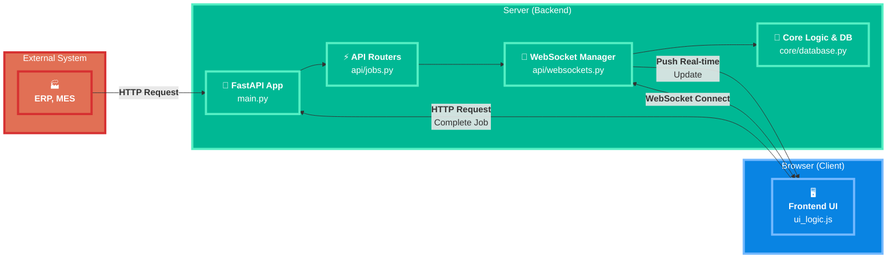

# RFID Smart Shelf API (v2.0 Refactored) - เอกสารสำหรับนักพัฒนา

เอกสารนี้สรุปโครงสร้าง สถาปัตยกรรม และรายละเอียดทางเทคนิคของโปรเจกต์ RFID Smart Shelf API เพื่อให้ง่ายต่อการทำความเข้าใจ บำรุงรักษา และต่อยอดในอนาคต

---

## 🚀 1. ภาพรวมโปรเจกต์ (Project Overview)

โปรเจกต์นี้คือ Backend Server สำหรับระบบชั้นวางของอัจฉริยะ (Smart Shelf) ทำหน้าที่จัดการ "งาน" (Jobs) เช่น การนำของไปเก็บ (Place) หรือนำของออก (Pick) และสื่อสารกับ Frontend (UI) แบบ Real-time ผ่าน WebSocket เพื่อแสดงสถานะของชั้นวางและงานที่ต้องทำ

**เทคโนโลยีหลัก:**
- **Backend:** Python, FastAPI
- **Real-time Communication:** WebSockets
- **Frontend:** HTML, CSS, JavaScript (Vanilla)
- **Server:** Uvicorn

---

## 🏛️ 2. สถาปัตยกรรม (Architecture)

### 2.1. High-Level Diagram

ไดอะแกรมนี้แสดงภาพรวมการไหลของข้อมูลระหว่างส่วนประกอบต่างๆ ของระบบ



### 2.2. โครงสร้างโปรเจกต์ (Project Structure)

```
RFID-smart-shelf/
├── src/
│   ├── api/
│   │   ├── __init__.py
│   │   ├── jobs.py         # (สำคัญ) จัดการ API ทั้งหมดที่เกี่ยวกับ Jobs และ Shelf
│   │   └── websockets.py   # (สำคัญ) จัดการการเชื่อมต่อ WebSocket และการส่งข้อความ
│   │
│   ├── core/
│   │   ├── __init__.py
│   │   ├── database.py     # (สำคัญ) "ฐานข้อมูลจำลอง" ใน Memory เก็บสถานะทั้งหมด
│   │   ├── models.py       # (สำคัญ) Pydantic Models สำหรับ validate request body
│   │   └── websocket_manager.py # (สำคัญ) จัดการการเชื่อมต่อ WebSocket
│   │
│   ├── static/             # เก็บไฟล์ Frontend (JS, CSS)
│   │   ├── css/
|   |   |   └── ui_styles.css # จัดการหน้าตา, Layout, และ Animation ทั้งหมด
│   │   └── js/
│   │       └── ui_logic.js # (สำคัญ) Logic ทั้งหมดของหน้า UI
│   │
│   ├── templates/          # เก็บไฟล์ HTML Templates
│   │   ├── shelf_ui.html   # หน้า UI หลัก
│   │   └── test_api.html   # หน้าสำหรับจำลองการทำงาน (Simulator)
│   │
│   └── main.py             # (สำคัญ) จุดเริ่มต้นของแอปพลิเคชัน ประกอบร่างทุกส่วนเข้าด้วยกัน
│
└── README.md               # ไฟล์นี้
```

---

## ⚙️ 3. การติดตั้งและรันโปรเจกต์ (Setup & Run)

1.  **สร้าง Virtual Environment (แนะนำ)**
    ```bash
    python -m venv .venv
    source .venv/bin/activate  # บน Mac/Linux
    .venv\Scripts\activate     # บน Windows
    ```

2.  **ติดตั้ง Dependencies:**
    ```bash
    pip install fastapi "uvicorn[standard]" jinja2
    ```

3.  **รัน Server:**
    เปิด Terminal แล้วรันคำสั่งจาก root directory ของโปรเจกต์:
    ```bash
    python src/main.py
    ```

4.  **เข้าถึงหน้าต่างๆ:**
    - **UI หลัก:** `http://localhost:8000/`
    - **Simulator:** `http://localhost:8000/simulator`
    - **API Docs (Swagger):** `http://localhost:8000/docs`
    - **Network Access (สำหรับ Pi/iPad):** `http://<YOUR_IP>:8000/` (Server จะแสดง IP ให้ตอนเริ่ม)

---

## 🔌 4. API Endpoints (เชิงลึก)

นี่คือ API ทั้งหมดที่มีในระบบ จัดการโดย `api/jobs.py`

### 4.1 System Endpoints

- **`GET /health`**
  - **หน้าที่:** ตรวจสอบว่า Server ทำงานอยู่หรือไม่
  - **Response:** `{"status": "ok", "message": "..."}`

- **`POST /api/system/reset`**
  - **หน้าที่:** ล้างข้อมูลทั้งหมดในระบบ (Jobs, Shelf State) ให้กลับสู่สถานะเริ่มต้น เหมาะสำหรับการทดสอบ
  - **การทำงาน:**
    1.  ล้าง `DB["jobs"]` และ `DB["job_counter"]`
    2.  สร้าง `DB["shelf_state"]` ขึ้นมาใหม่ทั้งหมด (4x6 ช่อง)
    3.  Broadcast message `system_reset` ผ่าน WebSocket เพื่อให้ UI รีเซ็ตตัวเอง

### 4.2 Job & Shelf Endpoints

- **`POST /api/jobs`**
  - **หน้าที่:** สร้างงานใหม่ (Place/Pick) มักจะถูกเรียกจากระบบภายนอก เช่น Postman หรือ iPad
  - **Request Body (`JobRequest` model):**
    ```json
    {
      "lot_no": "string",
      "level": "string",
      "block": "string",
      "place_flg": "string" // "1" for Place, "0" for Pick
    }
    ```
  - **การทำงาน:**
    1.  Validate request body ด้วย `JobRequest` model
    2.  สร้าง Job ID ใหม่
    3.  เพิ่ม Job เข้าไปใน `DB["jobs"]`
    4.  Broadcast message `new_job` ผ่าน WebSocket ไปยังทุก Client ที่เชื่อมต่ออยู่

- **`GET /api/jobs`**
  - **หน้าที่:** ดึงรายการงานทั้งหมดที่อยู่ในคิว
  - **Response:** `{"jobs": [...]}`

- **`POST /api/jobs/{job_id}/complete`**
  - **หน้าที่:** **(สำคัญ)** ยืนยันว่างานเสร็จสิ้นแล้ว (เช่น ผู้ใช้วางของในช่องเรียบร้อยแล้ว)
  - **การทำงาน:**
    1.  ค้นหา Job จาก `job_id`
    2.  อัปเดต `DB["shelf_state"]` ตามข้อมูลใน Job (เช่น เปลี่ยน `has_item` เป็น 1 และบันทึก `lot_no`)
    3.  ลบ Job ที่เสร็จแล้วออกจาก `DB["jobs"]`
    4.  Broadcast message `job_completed` พร้อมกับ `shelf_state` ที่อัปเดตแล้ว เพื่อให้ UI แสดงผลถูกต้อง

- **`POST /api/jobs/error`**
  - **หน้าที่:** รายงานข้อผิดพลาดที่เกิดขึ้นกับงาน (เช่น วางผิดช่อง)
  - **การทำงาน:**
    1.  ค้นหา Job ที่ Active อยู่
    2.  บันทึกข้อมูล Error ลงใน Job นั้น
    3.  Broadcast message `job_error` เพื่อให้ UI แสดงสถานะ Error

- **`GET /api/shelf/state`**
  - **หน้าที่:** ดึงข้อมูลสถานะของทุกช่องในชั้นวาง (ข้อมูลดิบ)
  - **Response:** `{"shelf_state": [[level, block, has_item, lot_no], ...]}`

- **`GET /api/shelf/occupied`**
  - **หน้าที่:** ดึงข้อมูลเฉพาะช่องที่มีของอยู่แล้ว
  - **Response:** `{"total_occupied": ..., "occupied_positions": [...]}`

- **`GET /api/shelf/summary`**
  - **หน้าที่:** ดึงข้อมูลสรุปภาพรวมของชั้นวางทั้งหมด
  - **Response:** `{"summary": {"total": ..., "occupied": ..., "empty": ...}, "occupied_details": [...]}`

---

## 📡 5. WebSocket Communication (`/ws`)

WebSocket คือหัวใจของการทำงานแบบ Real-time จัดการโดย `api/websockets.py`

- **ConnectionManager:** คลาสที่จัดการ Client ที่เชื่อมต่อทั้งหมด (เพิ่ม, ลบ, ส่งข้อความ)
- **Endpoint `/ws`:** เมื่อ Client เชื่อมต่อ จะถูกเพิ่มเข้าไปใน `manager` และจะได้รับ message ต่างๆ ที่ Server broadcast

**ประเภทของ Message ที่ถูก Broadcast:**

| Type | Trigger | Payload | หน้าที่ใน Frontend |
| :--- | :--- | :--- | :--- |
| `initial_state` | Client เชื่อมต่อครั้งแรก | `{jobs, shelf_state}` | โหลดสถานะล่าสุดทั้งหมดของระบบ |
| `new_job` | `POST /api/jobs` | `{...jobData}` | เพิ่มงานใหม่เข้าไปในคิวของ UI |
| `job_completed` | `POST /.../complete` | `{completedJobId, shelf_state}` | ลบงานที่เสร็จแล้วออกจากคิว และอัปเดตสีของชั้นวาง |
| `job_error` | `POST /api/jobs/error` | `{...jobData}` | แสดงสถานะ Error สำหรับงานที่กำลังทำ |
| `system_reset` | `POST /api/system/reset` | (ไม่มี) | ล้างข้อมูลทั้งหมดใน UI |

---

## 🧠 6. Core Logic

- **`core/database.py`**
  - **`DB` (Dictionary):** คือ "Single Source of Truth" ของระบบนี้ เป็นฐานข้อมูลจำลองที่เก็บใน Memory
    - `jobs`: List ของ Job ทั้งหมดที่อยู่ในคิว
    - `shelf_state`: List of lists ที่เก็บสถานะของทุกช่อง `[level, block, has_item, lot_no]`
    - `job_counter`: ตัวนับสำหรับสร้าง Job ID ที่ไม่ซ้ำกัน

- **`core/models.py`**
  - **`JobRequest` (Pydantic Model):** ใช้สำหรับ Validate ข้อมูลที่ส่งเข้ามาใน `POST /api/jobs` ทำให้มั่นใจได้ว่าข้อมูลที่รับมามี Format ที่ถูกต้องเสมอ

- **`main.py`**
  - **`uvicorn.run(app, host="0.0.0.0", ...)`:** การตั้งค่า `host="0.0.0.0"` ทำให้ Server รับการเชื่อมต่อจากทุก IP ในเครือข่าย ไม่ใช่แค่จาก `localhost` ซึ่งจำเป็นสำหรับการเชื่อมต่อจาก Raspberry Pi หรือ iPad

---

## 🤖 7. Workflow อัตโนมัติในอนาคต (Future Automation)

ในเวอร์ชันถัดไป ระบบจะถูกพัฒนาให้ทำงานอัตโนมัติโดยไม่ต้องกดปุ่ม "Select" บนหน้าจอ UI โดยมีขั้นตอนการทำงานดังนี้:

1.  **สร้างงาน:** งานใหม่ถูกส่งเข้ามาในระบบ (ผ่าน Postman หรือระบบอื่น) และเข้าไปอยู่ใน Job Queue

2.  **สแกน RFID:** พนักงานนำของ (ที่มี RFID Tag) มาที่หน้าชั้นวาง และเครื่องสแกน RFID อ่านค่า `lot_no` จาก Tag

3.  **ส่งข้อมูลไป Server:** เครื่องสแกน (หรือ Pi ที่เชื่อมต่ออยู่) เรียก API endpoint ใหม่: **`POST /api/rfid/scan`** พร้อมกับส่ง `lot_no` ที่สแกนได้
    ```json
    { "lot_no": "ABC123" }
    ```

4.  **Server ค้นหางาน:**
    -   Backend ค้นหา `lot_no` ที่ได้รับมาใน `DB["jobs"]` (Job Queue)
    -   **ถ้าเจอ:** Server จะ Broadcast message `auto_select_job` ผ่าน WebSocket พร้อมกับข้อมูลของงานที่เจอ
    -   **ถ้าไม่เจอ:** Server จะตอบกลับด้วยสถานะ 404 Not Found

5.  **UI เลือกงานอัตโนมัติ:**
    -   Frontend (`ui_logic.js`) ได้รับ message `auto_select_job`
    -   JavaScript จะตั้งค่างานนั้นให้เป็น "Active Job" โดยอัตโนมัติ
    -   หน้าจอจะเปลี่ยนจาก "Job Queue" ไปเป็นหน้าทำงานหลัก (แสดงตำแหน่งที่ต้องวาง) ทันที

**ผลลัพธ์:** Workflow จะราบรื่นและลดขั้นตอนการทำงานของผู้ใช้ลงอย่างมาก ผู้ใช้เพียงแค่นำของมาสแกนที่ชั้นวาง ระบบจะบอกตำแหน่งที่ต้องวางให้ทันที
