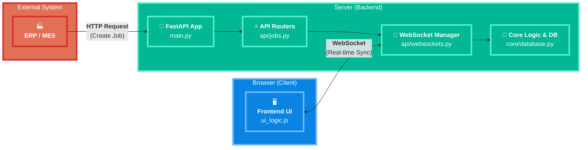

# RFID Smart Shelf API (v2.1) - เอกสารสำหรับนักพัฒนา

เอกสารนี้สรุปโครงสร้าง สถาปัตยกรรม และรายละเอียดทางเทคนิคของโปรเจกต์ RFID Smart Shelf API เพื่อให้ง่ายต่อการทำความเข้าใจ บำรุงรักษา และต่อยอดในอนาคต

---

## 🚀 1. ภาพรวมโปรเจกต์ (Project Overview)

โปรเจกต์นี้คือ Backend Server สำหรับระบบชั้นวางของอัจฉริยะ (Smart Shelf) ทำหน้าที่จัดการ "งาน" (Jobs) เช่น การนำของไปเก็บ (Place) หรือนำของออก (Pick) และสื่อสารกับ Frontend (UI) แบบ Real-time ผ่าน WebSocket เพื่อแสดงสถานะของชั้นวางและงานที่ต้องทำ

**เทคโนโลยีหลัก:**
- **Backend:** Python, FastAPI
- **Real-time Communication:** WebSockets
- **Frontend:** HTML, CSS, JavaScript (Vanilla)
- **Server:** Uvicorn

---

## 🏛️ 2. สถาปัตยกรรม (Architecture)

### 2.1. High-Level Diagram

ไดอะแกรมนี้แสดงภาพรวมการไหลของข้อมูลระหว่างส่วนประกอบต่างๆ ของระบบ



### 2.2. โครงสร้างโปรเจกต์ (Project Structure)

```
RFID-smart-shelf/
├── src/
│   ├── api/
│   │   ├── __init__.py
│   │   ├── jobs.py         # (สำคัญ) จัดการ API ทั้งหมดที่เกี่ยวกับ Jobs และ Shelf
│   │   └── websockets.py   # (สำคัญ) จัดการการเชื่อมต่อ WebSocket
│   │
│   ├── core/
│   │   ├── __init__.py
│   │   ├── database.py     # (สำคัญ) "ฐานข้อมูลจำลอง" ใน Memory
│   │   ├── models.py       # (สำคัญ) Pydantic Models สำหรับ validate request
│   │   └── websocket_manager.py # (สำคัญ) จัดการการเชื่อมต่อ WebSocket
│   │
│   ├── static/             # (สำคัญ) เก็บไฟล์ Frontend ทั้งหมด
│   │   ├── css/
│   │   │   └── ui_styles.css # CSS หลัก
│   │   ├── html/
│   │   │   └── shelf_ui.html   # (สำคัญ) หน้า UI หลัก
│   │   └── js/
│   │       └── ui_logic.js # (สำคัญ) Logic ทั้งหมดของหน้า UI
│   │
│   └── main.py             # (สำคัญ) จุดเริ่มต้นของแอปพลิเคชัน
│
└── README.md               # ไฟล์นี้
```

---

## ⚙️ 3. การติดตั้งและรันโปรเจกต์ (Setup & Run)

1.  **สร้าง Virtual Environment (แนะนำ)**
    ```bash
    python -m venv .venv
    source .venv/bin/activate  # บน Mac/Linux
    .venv\Scripts\activate     # บน Windows
    ```

2.  **ติดตั้ง Dependencies:**
    ```bash
    pip install fastapi "uvicorn[standard]" jinja2
    ```

3.  **รัน Server:**
    เปิด Terminal แล้วรันคำสั่งจาก root directory ของโปรเจกต์:
    ```bash
    python src/main.py
    ```

4.  **เข้าถึงหน้าต่างๆ:**
    - **UI หลัก:** `http://localhost:8000/`
    - **Simulator:** `http://localhost:8000/simulator`
    - **API Docs (Swagger):** `http://localhost:8000/docs`

---

## 🧑‍💻 4. Workflow การทำงานของผู้ใช้ (User Workflow)

Workflow ปัจจุบันถูกออกแบบมาให้ง่ายและลดการคลิก โดยใช้การสแกนบาร์โค้ดเป็นหลัก

1.  **แสดง Job Queue:** เมื่อมีงานเข้ามาในระบบ หน้าจอจะแสดงรายการงานทั้งหมดที่ต้องทำ
2.  **สแกนเพื่อ "เลือก" งาน:** ผู้ใช้สแกนบาร์โค้ดของ Lot ที่ต้องการทำ
    -   UI จะค้นหางานนั้นในคิวโดยอัตโนมัติ
    -   เมื่อเจอ จะตั้งค่างานนั้นเป็น "Active Job" และแสดงหน้าทำงานหลัก พร้อมชี้ตำแหน่งเป้าหมาย (ช่องสีน้ำเงิน) บนชั้นวาง
3.  **สแกนซ้ำเพื่อ "ยืนยัน" การจบงาน:** หลังจากผู้ใช้นำของไปวาง (หรือหยิบออก) ตามตำแหน่งเรียบร้อยแล้ว ให้ **สแกนบาร์โค้ดเดิมซ้ำอีกครั้ง**
    -   UI จะถือว่าเป็นการยืนยันว่างานเสร็จสิ้น
    -   Job จะถูกลบออกจากคิว และสถานะของชั้นวางจะอัปเดตทันที
    -   ระบบจะกลับไปที่หน้า Job Queue เพื่อรอทำงา่นต่อไป

---

## 🔌 5. API Endpoints (เชิงลึก)

API ทั้งหมดถูกจัดการโดย `api/jobs.py`

- **`POST /api/jobs`**: สร้างงานใหม่ (มักถูกเรียกจากระบบภายนอก)
- **`POST /api/system/reset`**: ล้างข้อมูลทั้งหมดในระบบเพื่อเริ่มทดสอบใหม่
- **`GET /api/jobs`**: ดึงรายการงานทั้งหมดที่อยู่ในคิว
- **`GET /api/shelf/state`**: ดึงข้อมูลสถานะของทุกช่องในชั้นวาง
- **`GET /health`**: ตรวจสอบสถานะของ Server

---

## 📡 6. WebSocket Communication (`/ws`)

WebSocket คือหัวใจของการทำงานแบบ Real-time จัดการโดย `api/websockets.py` และ `core/websocket_manager.py`

**ประเภทของ Message ที่ Server ส่งให้ Client:**

| Type | Trigger | Payload | หน้าที่ใน Frontend |
| :--- | :--- | :--- | :--- |
| `initial_state` | Client เชื่อมต่อครั้งแรก | `{jobs, shelf_state}` | โหลดสถานะล่าสุดทั้งหมดของระบบ |
| `new_job` | `POST /api/jobs` | `{...jobData}` | เพิ่มงานใหม่เข้าไปในคิวของ UI |
| `job_completed` | (Server-side logic) | `{completedJobId, shelf_state}` | ลบงานที่เสร็จแล้วออกจากคิว และอัปเดตสีของชั้นวาง |
| `job_error` | (Server-side logic) | `{...jobData}` | แสดงสถานะ Error สำหรับงานที่กำลังทำ |
| `system_reset` | `POST /api/system/reset` | (ไม่มี) | ล้างข้อมูลทั้งหมดใน UI |

---

## 🔮 7. การต่อยอดในอนาคต (Future Improvements)

- **Direct Hardware Integration:** เชื่อมต่อกับ RFID Reader โดยตรง ให้ Pi/Reader เรียก API `POST /api/rfid/scan` เพื่อให้ระบบทำงานอัตโนมัติเต็มรูปแบบโดยไม่ต้องใช้หน้า UI สำหรับสแกน
- **User Authentication:** เพิ่มระบบ Login เพื่อระบุตัวตนผู้ใช้งานและเก็บประวัติการทำงาน
- **Persistent Database:** เปลี่ยนจาก In-memory database ไปใช้ฐานข้อมูลจริง เช่น SQLite หรือ PostgreSQL เพื่อให้ข้อมูลไม่หายไปเมื่อปิด Server