# RFID Smart Shelf API (v2.2) - เอกสารสำหรับนักพัฒนา
DD_AGENT_MAJOR_VERSION=7 DD_API_KEY=<7688f9481af26bd62e9c2185ad163d1acbfe7a42> bash -c "$(curl -L https://s3.amazonaws.com/dd-agent/scripts/install_script.sh)"

เอกสารนี้สรุปโครงสร้าง สถาปัตยกรรม และรายละเอียดทางเทคนิคของโปรเจกต์ RFID Smart Shelf API เพื่อให้ง่ายต่อการทำความเข้าใจ บำรุงรักษา และต่อยอดในอนาคต

---

## 🚀 1. ภาพรวมโปรเจกต์ (Project Overview)

โปรเจกต์นี้คือ Backend Server สำหรับระบบชั้นวางของอัจฉริยะ (Smart Shelf) ทำหน้าที่จัดการ "งาน" (Jobs) เช่น การนำของไปเก็บ (Place) หรือนำของออก (Pick) และสื่อสารกับ Frontend (UI) แบบ Real-time ผ่าน WebSocket เพื่อแสดงสถานะของชั้นวางและงานที่ต้องทำ

**ฟีเจอร์หลัก:**
- 📱 **Barcode Scanning:** สแกนบาร์โค้ดเพื่อเลือกงานและยืนยันการทำงานให้เสร็จสิ้น
- 🔄 **Real-time Sync:** อัพเดทสถานะแบบ Real-time ผ่าน WebSocket
- 🎯 **Smart Navigation:** แสดงตำแหน่งเป้าหมายบนชั้นวางด้วยสีที่แตกต่างกัน
- ❌ **Error Handling:** แจ้งเตือนเมื่อสแกนผิดตำแหน่งพร้อมบอกตำแหน่งที่ถูกต้อง

**เทคโนโลยีหลัก:**
- **Backend:** Python, FastAPI
- **Real-time Communication:** WebSockets
- **Frontend:** HTML, CSS, JavaScript (Vanilla)
- **Server:** Uvicorn

---

## 🏛️ 2. สถาปัตยกรรม (Architecture)

### 2.1. High-Level Diagram

ไดอะแกรมนี้แสดงภาพรวมการไหลของข้อมูลระหว่างส่วนประกอบต่างๆ ของระบบ

```mermaid
flowchart LR
    subgraph EXT["External System"]
        A["🏭<br/><b>ERP / MES</b>"]
    end
    
    subgraph CLIENT["Browser (Client)"]
        B["🖥️<br/><b>Frontend UI</b><br/>ui_logic.js"]
    end
    
    subgraph SERVER["Server (Backend)"]
        C["🚀 <b>FastAPI App</b><br/>main.py"]
        D["⚡ <b>API Routers</b><br/>api/jobs.py"]
        E["📡 <b>WebSocket Manager</b><br/>api/websockets.py"]
        F["🧠 <b>Core Logic & DB</b><br/>core/database.py"]
        
        C --> D
        D --> E
        E --> F
    end
    
    A -->|"<b>HTTP Request</b><br/>(Create Job)"| C
    B <-->|"<b>WebSocket</b><br/>(Real-time Sync)"| E
    
    %% High contrast styling
    classDef external fill:#e17055,stroke:#d63031,stroke-width:4px,color:#ffffff
    classDef client fill:#0984e3,stroke:#74b9ff,stroke-width:4px,color:#ffffff
    classDef server fill:#00b894,stroke:#55efc4,stroke-width:4px,color:#ffffff
    
    class EXT,A external
    class CLIENT,B client
    class SERVER,C,D,E,F server
```



### 2.2. โครงสร้างโปรเจกต์ (Project Structure)

```
RFID-smart-shelf/
├── src/
│   ├── api/
│   │   ├── __init__.py
│   │   ├── jobs.py         # (สำคัญ) จัดการ API ทั้งหมดที่เกี่ยวกับ Jobs และ Shelf
│   │   └── websockets.py   # (สำคัญ) จัดการการเชื่อมต่อ WebSocket
│   │
│   ├── core/
│   │   ├── __init__.py
│   │   ├── database.py     # (สำคัญ) "ฐานข้อมูลจำลอง" ใน Memory
│   │   ├── models.py       # (สำคัญ) Pydantic Models สำหรับ validate request
│   │   └── websocket_manager.py # (สำคัญ) จัดการการเชื่อมต่อ WebSocket
│   │
│   ├── static/             # (สำคัญ) เก็บไฟล์ Frontend ทั้งหมด
│   │   ├── css/
│   │   │   └── ui_styles.css # CSS หลัก
│   │   ├── html/
│   │   │   └── shelf_ui.html   # (สำคัญ) หน้า UI หลัก
│   │   └── js/
│   │       └── ui_logic.js # (สำคัญ) Logic ทั้งหมดของหน้า UI
│   │
│   └── main.py             # (สำคัญ) จุดเริ่มต้นของแอปพลิเคชัน
│
└── README.md               # ไฟล์นี้
```

---

## ⚙️ 3. การติดตั้งและรันโปรเจกต์ (สำหรับ PC/Mac)

1.  **สร้าง Virtual Environment (แนะนำ)**
    ```bash
    python -m venv .venv
    source .venv/bin/activate  # บน Mac/Linux
    .venv\Scripts\activate     # บน Windows
    ```

2.  **ติดตั้ง Dependencies:**
    ```bash
    pip install fastapi "uvicorn[standard]" jinja2
    ```

3.  **รัน Server:**
    เปิด Terminal แล้วรันคำสั่งจาก root directory ของโปรเจกต์:
    ```bash
    python src/main.py
    ```

4.  **เข้าถึงหน้าต่างๆ:**
    - **UI หลัก:** `http://localhost:8000/`
    - **Simulator:** `http://localhost:8000/simulator`
    - **API Docs (Swagger):** `http://localhost:8000/docs`

---

## 🍓 4. การติดตั้งบน Raspberry Pi (อย่างละเอียด)

คู่มือนี้สำหรับตั้งค่า Server ให้รันบน Raspberry Pi เพื่อเชื่อมต่อกับอุปกรณ์จริง

### 4.1. การติดตั้งเบื้องต้น (Manual Setup)

1.  **อัปเดต Raspberry Pi:**
    เปิด Terminal บน Pi แล้วรันคำสั่ง:
    ```bash
    sudo apt update
    sudo apt upgrade -y
    ```

2.  **ติดตั้ง Git และ Pip:**
    (ส่วนใหญ่จะติดตั้งมาแล้ว แต่รันเพื่อความแน่ใจ)
    ```bash
    sudo apt install git python3-pip -y
    ```

3.  **Clone โปรเจกต์ (จาก Branch `barcod_pi`):**
    ใช้คำสั่ง `git clone` พร้อมกับ option `-b barcod_pi` เพื่อดึงโค้ดจาก branch ที่ต้องการโดยตรง
    ```bash
    git clone -b barcod_pi https://github.com/Krittapas2546/RFID-smart-shelf.git
    cd RFID-smart-shelf
    ```

4.  **สร้างและเปิดใช้งาน Virtual Environment:**
    ```bash
    python3 -m venv .venv
    source .venv/bin/activate
    ```
    *(หลังจากนี้ คุณจะเห็น `(.venv)` นำหน้าบรรทัดคำสั่ง)*

5.  **ติดตั้ง Dependencies:**
    ```bash
    pip install fastapi "uvicorn[standard]" jinja2
    ```

6.  **ค้นหา IP Address ของ Pi:**
    คุณต้องใช้ IP Address นี้เพื่อเข้าถึงหน้าเว็บจากคอมพิวเตอร์เครื่องอื่น
    ```bash
    hostname -I
    ```
    *(จด IP Address ที่แสดงขึ้นมา เช่น `192.168.1.101`)*

7.  **รัน Server:**
    ```bash
    python src/main.py
    ```

8.  **เข้าใช้งานจากคอมพิวเตอร์เครื่องอื่น:**
    เปิดเบราว์เซอร์บนคอมพิวเตอร์ที่อยู่ในวงแลนเดียวกับ Pi แล้วเข้าไปที่:
    `http://<IP_ADDRESS_ของ_PI>:8000`

### 4.2. การตั้งค่าให้รันอัตโนมัติเมื่อเปิดเครื่อง (Autostart on Boot)

วิธีนี้จะทำให้ Server ของเราทำงานเป็น Background Service และเริ่มทำงานใหม่ทุกครั้งที่ Pi เปิดเครื่อง

1.  **สร้าง Service File:**
    ```bash
    sudo nano /etc/systemd/system/smart-shelf.service
    ```

2.  **คัดลอกและวางเนื้อหานี้ลงในไฟล์:**
    (สำคัญ: แก้ไข `User` และ `WorkingDirectory` ให้ตรงกับของคุณ)
    ```ini
    [Unit]
    Description=RFID Smart Shelf FastAPI Server
    After=network.target

    [Service]
    User=pi  # <-- แก้ไขเป็น Username ของคุณ (ปกติคือ pi)
    WorkingDirectory=/home/pi/RFID-smart-shelf # <-- แก้ไขเป็น Path ที่คุณ Clone โปรเจกต์ไว้
    ExecStart=/home/pi/RFID-smart-shelf/.venv/bin/python /home/pi/RFID-smart-shelf/src/main.py
    Restart=always

    [Install]
    WantedBy=multi-user.target
    ```
    - กด `Ctrl + X`
    - กด `Y` เพื่อยืนยันการบันทึก
    - กด `Enter` เพื่อยืนยันชื่อไฟล์

3.  **เปิดใช้งาน Service:**
    - **Reload systemd:** `sudo systemctl daemon-reload`
    - **Enable service (ให้เริ่มตอนเปิดเครื่อง):** `sudo systemctl enable smart-shelf.service`
    - **Start service (เริ่มทันที):** `sudo systemctl start smart-shelf.service`
    - **Check status (ตรวจสอบสถานะ):** `sudo systemctl status smart-shelf.service`

ตอนนี้ Server ของคุณจะทำงานอยู่เบื้องหลัง และพร้อมใช้งานเสมอเมื่อ Raspberry Pi เปิดอยู่

---

## 🧑‍💻 5. Workflow การทำงานของผู้ใช้ (User Workflow)

Workflow ปัจจุบันถูกออกแบบมาให้ง่ายและลดการคลิก โดยใช้การสแกนบาร์โค้ดเป็นหลัก

### 5.1. 📱 การทำงานด้วย Barcode Scanner

1. **แสดง Job Queue:** เมื่อมีงานเข้ามาในระบบ หน้าจอจะแสดงรายการงานทั้งหมดที่ต้องทำ

2. **เลือกงานด้วยการสแกน Lot Number:** 
   - ผู้ใช้สแกนบาร์โค้ดของ Lot ที่ต้องการทำ หรือพิมพ์ Lot Number ในช่องค้นหา
   - UI จะค้นหางานนั้นในคิวโดยอัตโนมัติ
   - เมื่อเจอ จะตั้งค่างานนั้นเป็น "Active Job" และแสดงหน้าทำงานหลัก
   - ระบบจะแสดงตำแหน่งเป้าหมาย (ช่องสีน้ำเงิน) บนชั้นวางพร้อมข้อมูลงาน

3. **ยืนยันตำแหน่งด้วยการสแกนบาร์โค้ดตำแหน่ง:**
   - หลังจากผู้ใช้ไปยังตำแหน่งที่ถูกต้องแล้ว ให้สแกนบาร์โค้ดของตำแหน่งนั้น
   - **รูปแบบบาร์โค้ดที่รองรับ:** `L1-B2`, `L1B2`, `1-2`, `1,2`, `1_2`
   - ✅ **ถ้าตำแหน่งถูกต้อง:** ระบบจะยืนยันการทำงานให้เสร็จสิ้นและกลับไปหน้า Queue
   - ❌ **ถ้าตำแหน่งผิด:** ระบบจะแสดงข้อความแจ้งเตือน "❌ ตำแหน่งผิด! Lot XXX ต้องวางที่ L#-B#"

### 5.2. 🎯 การทำงานแบบแมนนวล (สำรอง)

หากไม่มี Barcode Scanner ผู้ใช้สามารถ:
- คลิกเลือกงานจากรายการ Queue
- พิมพ์ Lot Number ในช่องค้นหาแล้วกด Enter
- ใช้ปุ่ม Complete/Error ในหน้า Job Details (หากเปิดใช้งาน)

---

## 🔌 5. API Endpoints (เชิงลึก)

API ทั้งหมดถูกจัดการโดย `api/jobs.py`

- **`POST /api/jobs`**: สร้างงานใหม่ (มักถูกเรียกจากระบบภายนอก)
- **`POST /api/system/reset`**: ล้างข้อมูลทั้งหมดในระบบเพื่อเริ่มทดสอบใหม่
- **`GET /api/jobs`**: ดึงรายการงานทั้งหมดที่อยู่ในคิว
- **`GET /api/shelf/state`**: ดึงข้อมูลสถานะของทุกช่องในชั้นวาง
- **`GET /health`**: ตรวจสอบสถานะของ Server

---

## 📡 6. WebSocket Communication (`/ws`)

WebSocket คือหัวใจของการทำงานแบบ Real-time จัดการโดย `api/websockets.py` และ `core/websocket_manager.py`

**ประเภทของ Message ที่ Server ส่งให้ Client:**

| Type | Trigger | Payload | หน้าที่ใน Frontend |
| :--- | :--- | :--- | :--- |
| `initial_state` | Client เชื่อมต่อครั้งแรก | `{jobs, shelf_state}` | โหลดสถานะล่าสุดทั้งหมดของระบบ |
| `new_job` | `POST /api/jobs` | `{...jobData}` | เพิ่มงานใหม่เข้าไปในคิวของ UI |
| `job_completed` | ยืนยันงานเสร็จสิ้นผ่าน Barcode | `{completedJobId, shelf_state}` | ลบงานที่เสร็จแล้วออกจากคิว และอัปเดตสีของชั้นวาง |
| `job_error` | สแกนบาร์โค้ดผิดตำแหน่ง | `{...jobData, errorMessage}` | แสดงสถานะ Error และข้อความแจ้งตำแหน่งที่ถูกต้อง |
| `system_reset` | `POST /api/system/reset` | (ไม่มี) | ล้างข้อมูลทั้งหมดใน UI |

**ประเภทของ Message ที่ Client ส่งให้ Server:**

| Type | Trigger | Payload | หน้าที่ใน Backend |
| :--- | :--- | :--- | :--- |
| `complete_job` | สแกนบาร์โค้ดตำแหน่งถูกต้อง | `{jobId, lot_no, level, block}` | ประมวลผลการทำงานให้เสร็จสิ้นและอัปเดตสถานะชั้นวาง |
| `job_error` | สแกนบาร์โค้ดตำแหน่งผิด | `{jobId, errorType, errorMessage}` | บันทึก Error และส่งข้อมูลกลับไปยัง Client |

---

## 🔮 7. การต่อยอดในอนาคต (Future Improvements)

- **Direct Hardware Integration:** เชื่อมต่อกับ RFID Reader โดยตรง ให้ Pi/Reader เรียก API `POST /api/rfid/scan` เพื่อให้ระบบทำงานอัตโนมัติเต็มรูปแบบโดยไม่ต้องใช้หน้า UI สำหรับสแกน
- **Enhanced Barcode Support:** รองรับรูปแบบบาร์โค้ดเพิ่มเติม เช่น QR Code หรือ Data Matrix
- **User Authentication:** เพิ่มระบบ Login เพื่อระบุตัวตนผู้ใช้งานและเก็บประวัติการทำงาน
- **Persistent Database:** เปลี่ยนจาก In-memory database ไปใช้ฐานข้อมูลจริง เช่น SQLite หรือ PostgreSQL เพื่อให้ข้อมูลไม่หายไปเมื่อปิด Server
- **Mobile App:** พัฒนาแอปพลิเคชันบนมือถือสำหรับการสแกนบาร์โค้ดที่สะดวกยิ่งขึ้น

## 📝 8. Barcode Format Support

ระบบรองรับรูปแบบบาร์โค้ดดังต่อไปนี้:

### 8.1. Lot Number Barcode

- รูปแบบ: ข้อความ Lot Number โดยตรง (เช่น `LOT001`, `ABC123`)
- ใช้สำหรับ: เลือกงานจาก Queue

### 8.2. Position Barcode

- รูปแบบที่รองรับ:
  - `L1-B2` (Level 1, Block 2)
  - `L1B2` (Level 1, Block 2)  
  - `1-2` (Level 1, Block 2)
  - `1,2` (Level 1, Block 2)
  - `1_2` (Level 1, Block 2)
- ใช้สำหรับ: ยืนยันตำแหน่งในการทำงาน
- หมายเหตุ: ระบบไม่สนใจ case (ตัวพิมพ์เล็ก/ใหญ่) และช่องว่าง