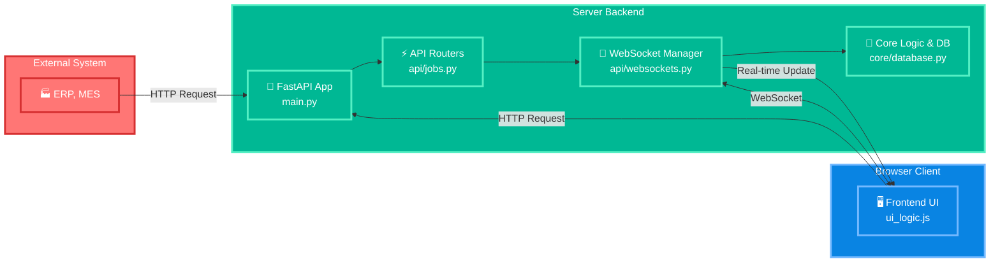

# RFID Smart Shelf - Software Architecture

เอกสารนี้อธิบายสถาปัตยกรรมซอฟต์แวร์, การไหลของข้อมูล, และหน้าที่ความรับผิดชอบของแต่ละส่วนประกอบในระบบ RFID Smart Shelf

## 1. High-Level Architecture Diagram
<!-- [MermaidChart: 8140fa33-05b0-47bb-ae03-f908110dfd06] -->

## 2. Component Breakdown

### 2.1. Backend Server

เป็น "สมอง" ของระบบที่สร้างด้วย **FastAPI** ซึ่งมีข้อดีในเรื่องประสิทธิภาพ, การทำเอกสาร API อัตโนมัติ, และการรองรับ `async`

-**`main.py` (Entry Point)**
    -**หน้าที่:** ประกอบร่าง (Assemble) ทุกส่วนของแอปพลิเคชันเข้าด้วยกัน
    -**การทำงาน:**
        -   สร้าง FastAPI instance หลัก
        -   `app.mount("/static", ...)`: ทำหน้าที่เสิร์ฟไฟล์ Frontend (JS, CSS)
        -   `app.include_router(...)`: **(สำคัญ)** นำเข้า `APIRouter` จากไฟล์ต่างๆ (`jobs.py`, `websockets.py`) เพื่อให้แอปพลิเคชันรู้จักทุก Endpoint

-**`api/` (API Layer)**
    -**`jobs.py` (HTTP API Router)**
        -**หน้าที่:** กำหนด HTTP Endpoints ทั้งหมด (`/api/jobs`, `/api/system/reset`, etc.)
        -**การทำงาน:** รับ Request, เรียกใช้ Logic จาก `core` เพื่อจัดการข้อมูล, และส่ง Response กลับไป เป็นส่วนที่จัดการ Business Logic ของแต่ละคำขอ
    -**`websockets.py` (WebSocket Router)**
        -**หน้าที่:** กำหนด Endpoint `/ws` สำหรับการเชื่อมต่อแบบ Real-time
        -**การทำงาน:** เมื่อ Client เชื่อมต่อเข้ามา จะทำการลงทะเบียน Client คนนั้นผ่าน `websocket_manager` และส่ง `initial_state` กลับไปให้

-**`core/` (Core Logic Layer)**
    -**`database.py` (In-Memory Database)**
        -**หน้าที่:** เป็น **Single Source of Truth** ของระบบ
        -**การทำงาน:** เก็บ State ทั้งหมดของแอปพลิเคชัน (Jobs, Shelf State) ไว้ใน Dictionary (`DB`) การแยกส่วนนี้ออกมาทำให้ Logic การจัดการข้อมูลไม่ผูกติดกับ API Layer และง่ายต่อการทดสอบ
    -**`websocket_manager.py` (Connection Manager)**
        -**หน้าที่:** จัดการ Client ที่เชื่อมต่อผ่าน WebSocket ทั้งหมด
 -**การทำงาน:** มี List ของ `active_connections` และมี method `connect`, `disconnect`, และ `broadcast` เพื่อส่งข้อมูลไปยัง Client ทุกคนที่เชื่อมต่ออยู่
    -**`models.py` (Pydantic Models)**
        -**หน้าที่:** กำหนด Schema และ Validation Rules สำหรับข้อมูล
        -**การทำงาน:** FastAPI ใช้โมเดลเหล่านี้ (เช่น `JobRequest`) เพื่อตรวจสอบและแปลง (Parse) ข้อมูลที่ส่งมาใน Request Body โดยอัตโนมัติ

### 2.2. Frontend Client

เป็นส่วนติดต่อผู้ใช้ที่ทำงานบนเบราว์เซอร์ สร้างด้วย Vanilla JavaScript, HTML, และ CSS

-**`templates/` & `static/`**
    -**`shelf_ui.html`**: โครงสร้างหน้าเว็บหลัก มี `div` ที่มี `id` เตรียมไว้ให้ JavaScript จัดการ
    -**`ui_styles.css`**: จัดการหน้าตา, Layout, และ Animation ทั้งหมด
    -**`ui_logic.js`**: "สมอง" ของฝั่ง Frontend
        -**State Management:** ใช้ `localStorage` เพื่อเก็บสถานะของคิวและ Active Job ทำให้ข้อมูลไม่หายเมื่อผู้ใช้รีเฟรชหน้า
        -**Rendering:** ฟังก์ชัน `renderAll()` คือหัวใจหลัก ทำหน้าที่ตรวจสอบ State ปัจจุบันแล้ววาด UI ที่ถูกต้อง (หน้าเลือกงาน หรือ หน้าทำงาน)
        -**WebSocket Handling:** `setupWebSocket()` สร้างการเชื่อมต่อ และ `ws.onmessage` รอรับข้อมูลจาก Server เพื่ออัปเดต UI แบบ Real-time โดยไม่ต้องรีเฟรช

## 3. Key Data Flows

### Flow A: Creating a New Job (HTTP Request)

1.**External System** ส่ง `POST /api/jobs` พร้อมข้อมูล Job ใน Request Body
2.**`main.py`** รับ Request และส่งต่อไปยัง `jobs.router`
3.**`jobs.py`** ใช้ `JobRequest` model จาก **`models.py`** เพื่อ Validate ข้อมูล
4.ข้อมูลถูกบันทึกลงใน `DB` dictionary ใน **`database.py`**
5.**`jobs.py`** เรียก `manager.broadcast()` จาก **`websocket_manager.py`**
6.**`websocket_manager.py`** ส่ง message `type: "new_job"` ไปยัง Client ทุกคนที่เชื่อมต่ออยู่
7.**`ui_logic.js`** ในเบราว์เซอร์รับ message, อัปเดต `localStorage`, และเรียก `renderAll()` เพื่อแสดง Job ใหม่ในคิว

### Flow B: Real-time UI Update (WebSocket Push)

1.เมื่อมีเหตุการณ์เกิดขึ้นใน Backend (เช่น Job เสร็จสิ้น, มี Error)
2.Logic ใน **`jobs.py`** จะทำการแก้ไขข้อมูลใน **`database.py`**
3.จากนั้นจะเรียก `manager.broadcast()` พร้อม `payload` ที่เหมาะสม (เช่น `type: "job_completed"`)
4.**`websocket_manager.py`** วน Loop ส่ง JSON message นี้ไปให้ทุกการเชื่อมต่อที่ Active อยู่
5.**`ui_logic.js`** ใน `ws.onmessage` handler จะได้รับข้อมูล, แยกแยะ `type` ของ message, และเรียกฟังก์ชันที่เหมาะสมเพื่ออัปเดต UI (เช่น ลบ Job ออกจาก List, เปลี่ยนสีช่องบนชั้นวาง)

สถาปัตยกรรมนี้มีการแบ่งหน้าที่ความรับผิดชอบ (Separation of Concerns) ที่ชัดเจน ทำให้ง่ายต่อการบำรุงรักษา,
